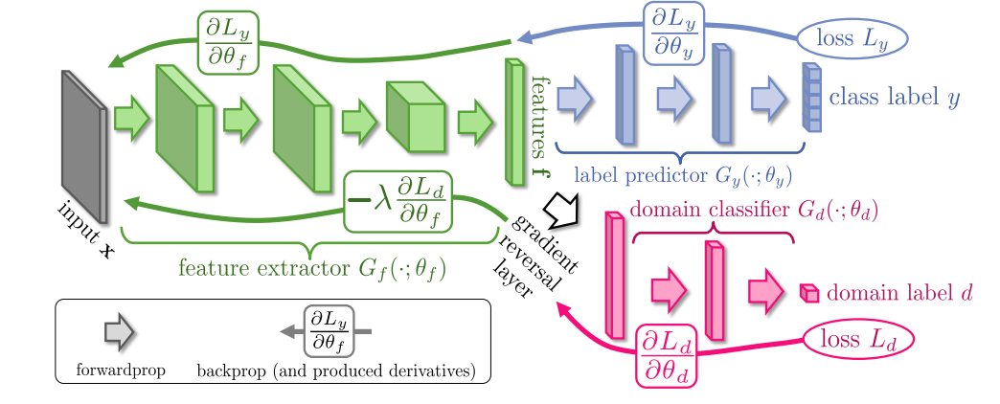

# Domain Adaptation


Adapted implementation of (Ganin *et al*) on CIFAR-10 dataset and comparison with entropy-minimization



​																										*Image courtesy: Ganin et al*


### Training model

```bash
python train.py --batch 128 --epochs 200 
```

data will be downloaded in ```data/``` and base model will be stored at ```ckpt.pth``` 

```bash
python domain_adaptation.py --perturb <gaussian noise perturbation> --pretrained --epochs 40 --lr 0.0001
```

This will train the label predictor and the domain classifier as shown in the figure above. Do not use ```--pretrained``` if you want to train the entire model from scratch. Model logs will be stored in a folder inside ```mlruns/```  including the hyper-parameters, epochs and the best model. For more details, kindly refer to Ganin *et al*.

For comparison one can perform pseudo entropy minimization with the following script

```bash
python tune_entropy.py --perturb 10 --epochs 20
```


### References

Ganin, Yaroslav, and Victor Lempitsky. [Unsupervised domain adaptation by backpropagation](https://arxiv.org/abs/1409.7495). *International conference on machine learning*. PMLR, 2015.

